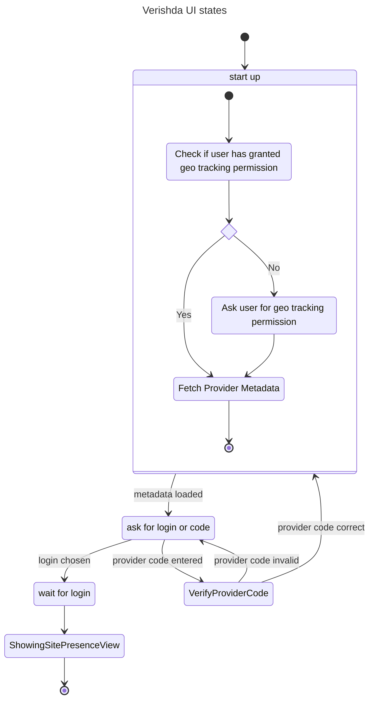

```mermaid
---
title: Verishda UI states
---
stateDiagram-v2

    state "start up" as Startup {
        state "Fetch Provider Metadata" as FetchProviderMetadata
        state "Check if user has granted geo tracking permission" as CheckLocationPermission
        state CheckLocationPermission_choice <<choice>>
        state "Ask user for geo tracking permission" as RequestLocationPermission

        [*] --> CheckLocationPermission
        CheckLocationPermission --> CheckLocationPermission_choice
        CheckLocationPermission_choice --> RequestLocationPermission: No
        CheckLocationPermission_choice --> FetchProviderMetadata: Yes
        RequestLocationPermission --> FetchProviderMetadata
        FetchProviderMetadata --> [*]
    }
    state "ask for login or code" as ShowingWelcomeView
    state "wait for login" as ShowingWaitingForLoginView

    [*] --> Startup

    Startup --> ShowingWelcomeView: metadata loaded
    ShowingWelcomeView --> ShowingWaitingForLoginView : login chosen
    ShowingWelcomeView --> VerifyProviderCode : provider code entered
    VerifyProviderCode --> Startup : provider code correct
    VerifyProviderCode --> ShowingWelcomeView : provider code invalid
    ShowingWaitingForLoginView --> ShowingSitePresenceView
    ShowingSitePresenceView -->  [*]


```